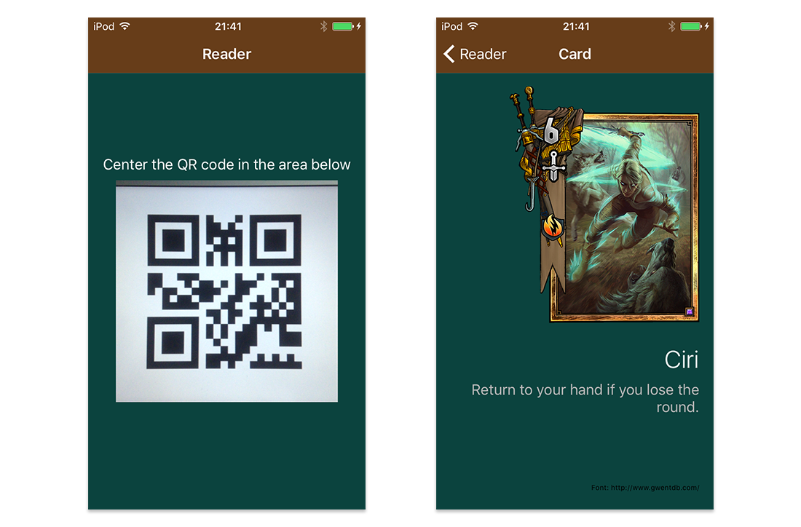
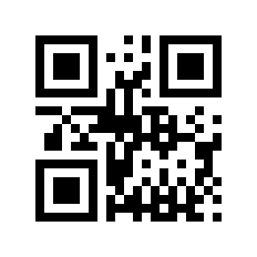
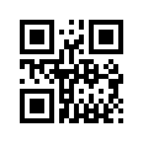
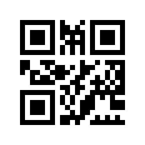
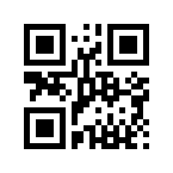

# The App
This is a simple app to scan QR Codes. The main goal here is to show how to write a QR code reader without adding one more responsibility to our *ViewController*. 

#UI

#Medium post

[How to properly write a ViewController that scans QR Codes](https://medium.com/@danielcarlosce/how-to-properly-write-a-viewcontroller-that-scans-qr-codes-6f22ab2d2e99#.6ndtiul2t)

# Codes for test
We are using a mock data source and we have four codes that will be recognized by the application:

 
 
